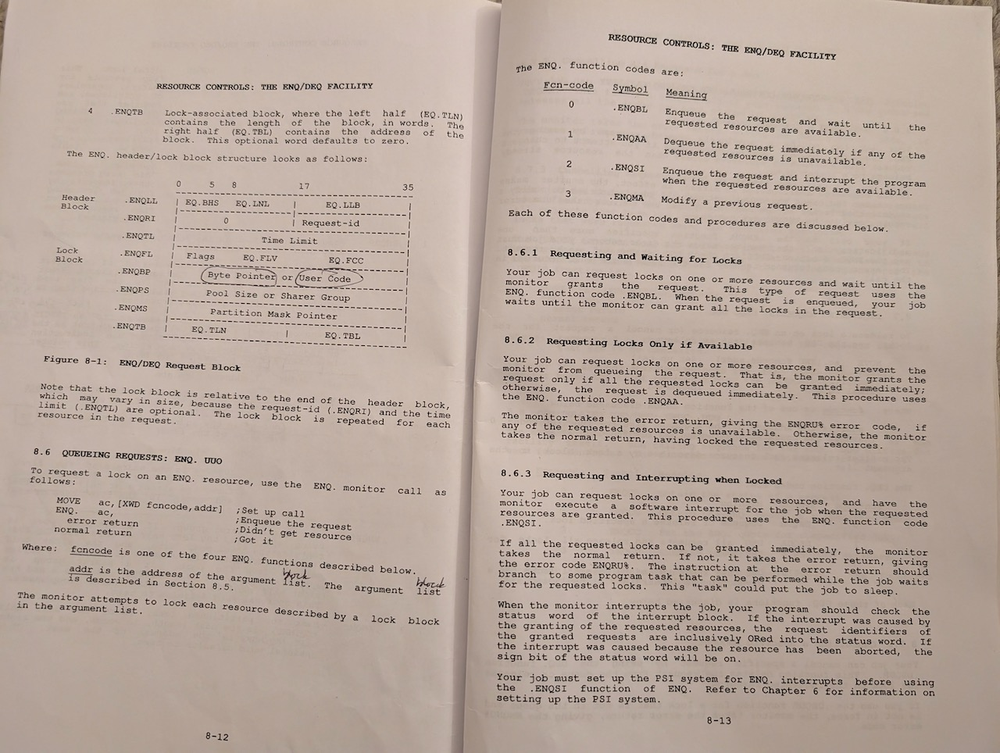

Decwar's journey from an academic setting to a commercial one precipitated a fundamental shift in operational demands. The original UT Austin game ran as a single galaxy, meaning a single game board and single area of shared high segment memory. Each player ship was a DECWAR job running under TOPS-10 monitor control. If all eighteen player ships were in use, there were eighteen DECWAR jobs running on the PDP-10. This was the maximum possible.

CompuServe's business model was predicated on scale. To serve its customer base, it needed to run multiple, simultaneous galaxies (multiple game boards and multiple areas of shared high segment memory) on a single PDP-10. CompuServe limited the number of player ships in a galaxy to ten. If thirty customers were playing, there were three galaxies, three areas of shared memory, and thirty DECWAR jobs running on the PDP-10. From these facts alone, it’s apparent that there were scaling challenges.

Decreasing the number of player ships per galaxy from eighteen to ten did shrink and limit the shared memory footprint of each individual galaxy. Meanwhile, each player ship had to be firmly associated with one galaxy and one shared memory area. This is the motivation for a galaxy identifier, the game number, an integer valued variable GAMENO. Each player ship had a GAMENO tying it to one of the active galaxies.

In CompuServe’s customization of the WARMAC lock and unlock code, each player ship included its GAMENO in the request blocks it submitted to ENQ or DEQ. The advantages of simplicity with the reference implementation discussed in the previous section are compromised. The request blocks become more complex, and are coupled. A player’s request blocks for DEQ included the same GAMENO as the request blocks for ENQ. In fact, the request blocks in the CompuServe lock and unlock code are complex and exceedingly hard to understand. At least the basic outlines are comprehensible, however, and there’s no question that the CompuServe request blocks include a byte pointer to what today would be termed a character string.

Here’s relevant information from the TOPS-10 Monitor Calls Manual.

\[Each request includes a\] resource identifier in the form of a numeric value or a pointer to an ASCIZ string … \[either\] a 36-bit numeric value if EQ.FCW is set in the flag word … \[or\] ENQBP contains a pointer to an ASCIZ string of up to 30 words (150 characters) that is the name of the resource.

CompuServe’s customization of the WARMAC lock and unlock code does use the second of these options, a pointer to an ASCIZ string.

We can make some additional inferences relating to the nature of the ASCIZ strings used. They involved a lookup table, accessed via a key. This was a primitive Assembly language form of a modern key-value pair Dictionary Datatype. Given the key, the lookup returned a resource identifier ASCIZ string, for example RESOURCE-123-GAMENO-. Then the game number could be dynamically appended. If two players in two galaxies locked the same resource identifier simultaneously, they would use ASCIZ strings RESOURCE-123-GAMENO-1 and RESOURCE-123-GAMENO-2. The two locks are distinguished by galaxy, based on their game number.

